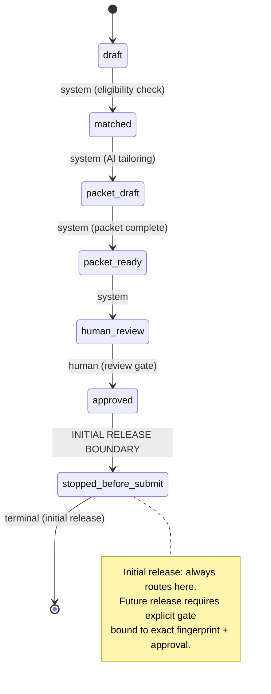
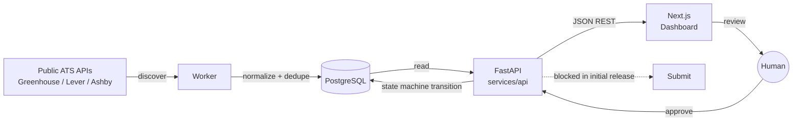
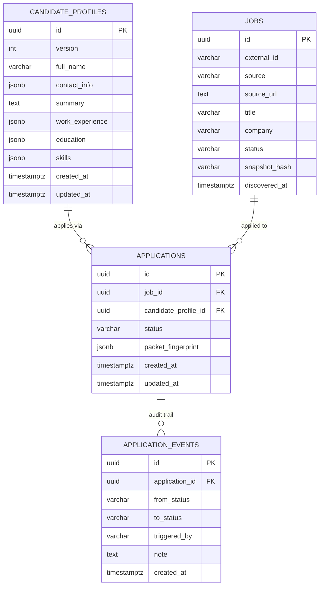
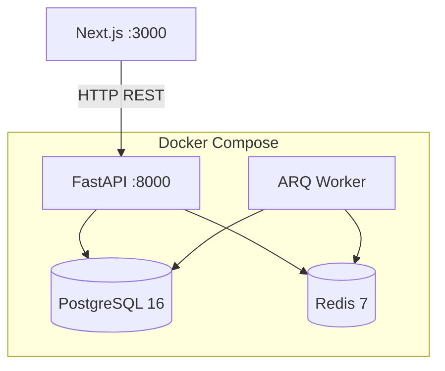
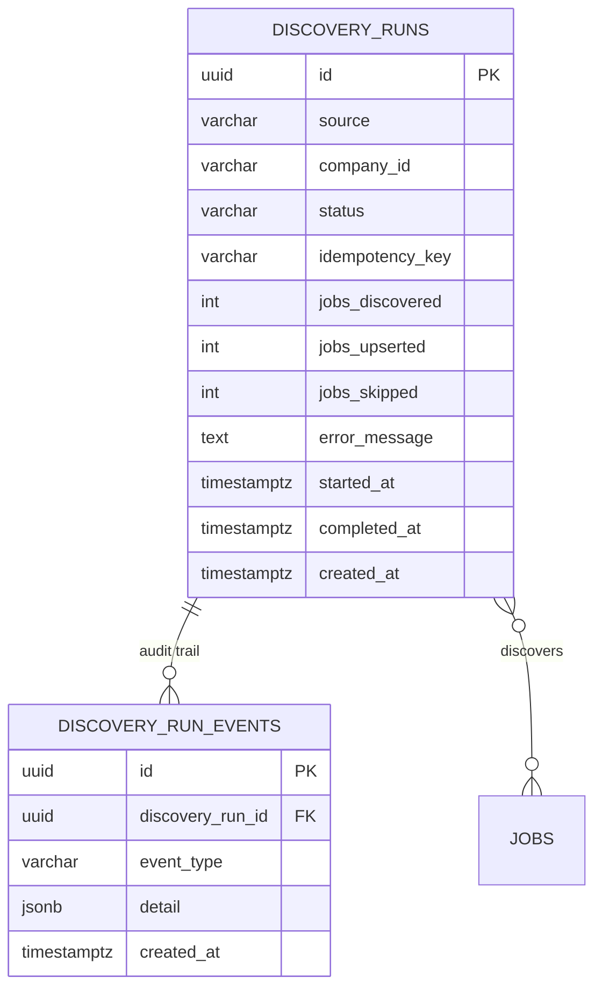
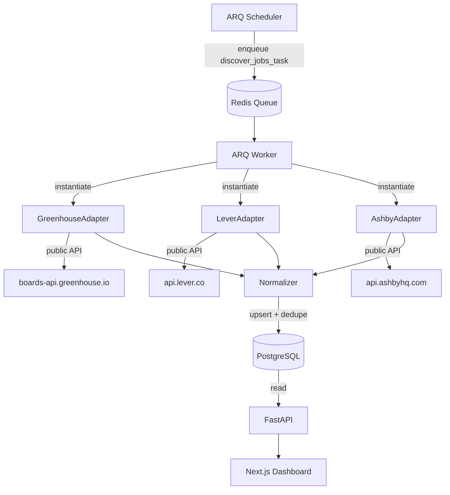
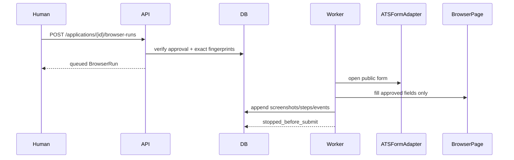
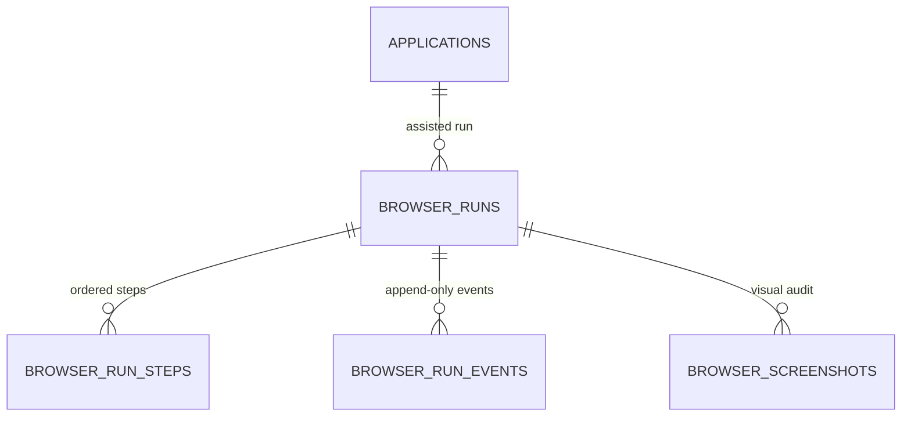

# CareerPilot Architecture

CareerPilot is a monorepo combining a React dashboard, FastAPI service, ARQ worker, and PostgreSQL/Redis infrastructure. The initial release boundary is: **always stop before final submission**.

## System Overview

CareerPilot helps a single candidate discover public job listings, prepare application packets, and review them before a human decides whether to proceed. It does NOT automatically submit applications in any release. The `INITIAL_SUBMISSION_MODE=stop_before_submit` environment variable is enforced at the state machine level and checked by CI.

## Component Map

```
career-pilot/
├── apps/dashboard      Next.js 14 (App Router) · TypeScript strict
├── services/api        FastAPI · SQLAlchemy async · Pydantic v2
├── services/worker     ARQ worker · ATS adapter interfaces (stubs in Phase 1)
├── packages/contracts  Shared TypeScript types + Zod schemas
├── packages/ui         Accessible React primitives (Tailwind)
├── db/                 Alembic migrations · Fake seed data
├── fixtures/mock-ats   Future browser test fixtures (Phase 5)
├── infra/              Docker Compose
└── docs/               Architecture · ADRs · Security
```

## Application State Machine

The state machine is the core safety mechanism. In initial release mode (`INITIAL_SUBMISSION_MODE=stop_before_submit`), the transition to `submitted` is unconditionally blocked at the service layer. The state machine is tested with a BFS reachability check that proves `SUBMITTED` cannot be reached from `DRAFT` under this mode.



## Data Flow



## Data Model Overview



## Packet Fingerprint

Before an application can be approved, a `PacketFingerprint` is computed and bound to the application record. Any change to any input field invalidates the fingerprint and requires regeneration and re-approval by a human.

| Field | Description |
|---|---|
| `profile_version` | Candidate profile version at packet generation time |
| `resume_version` | Resume version used in the packet |
| `answer_versions` | Map of `questionId` to answer version |
| `job_snapshot_hash` | SHA-256 of the raw job description at discovery time |
| `packet_hash` | SHA-256 of the full rendered packet |

## Safety Boundary

| Rule | Enforcement |
|---|---|
| No submission without explicit gate | State machine raises `SubmissionBlockedError` in initial mode |
| No CAPTCHA solving | Not implemented; pattern banned by prohibited-automation CI scan |
| No credential storage | No password columns in schema; secret scan in CI |
| No inbox code retrieval | Not implemented; pattern banned by prohibited-automation CI scan |
| No proxy rotation | Not implemented; pattern banned by prohibited-automation CI scan |
| Fake data only in seeds | Seeds use `.invalid` email domains (RFC 2606) |

## Infrastructure



## Phase 2 Discovery Data Model



## Phase 2 Adapter Architecture



## Phase 5 Assisted Application Boundary

The API creates a queued `BrowserRun` only after checking `approved`, exact `packet_fingerprint`, and immutable inputs. A supervised ARQ task receives a visible/headful Playwright-compatible page and a clean-room ATS form adapter. It can `goto`, fill allowlisted fields, and screenshot; it cannot submit. Steps, events, and screenshot metadata are append-only child records. Successful runs end at `stopped_before_submit`; no browser-run path can reach `submitted`.



## Phase 5 Browser Run Data Model



A browser run is created only for an approved application and stores the exact packet fingerprint, immutable inputs, approved fields, visible/headful setting, adapter name, ordered steps/events, and screenshot metadata. The worker has no submit operation; every successful flow ends at `stopped_before_submit`.

## Assisted Application Safety Boundary

| Rule | Enforcement |
|---|---|
| Exact approved packet required | API compares request fingerprint and immutable inputs with the application |
| Visible browser only | Headless requests are rejected; the worker requires an operator-provided page |
| Only approved fields | API and worker allowlist non-sensitive fields and reject sensitive/unknown keys |
| Auditable run | Steps, events, and screenshots are persisted in ordered tables |
| No employer submission | Worker exposes no submit operation and ends at `stopped_before_submit` |


| ADR | Title | Status |
|---|---|---|
| [0001](adr/0001-stop-before-submit.md) | Initial Release Always Stops Before Final Submission | Accepted |
| [0002](adr/0002-application-state-machine.md) | Immutable Append-Only Application Event Log | Accepted |
| [0003](adr/0003-monorepo-structure.md) | Monorepo with Turborepo and Isolated Python Services | Accepted |
| [0004](adr/0004-job-discovery-adapters.md) | Public ATS Adapters and Generic Crawler Boundary | Accepted |
| [0005](adr/0005-deterministic-matching.md) | Deterministic Profile Matching | Accepted |
| [0006](adr/0006-application-materials-review.md) | Truthful Application Materials and Human Review | Accepted |
| [0007](adr/0007-approval-bound-visible-browser-worker.md) | Approval-Bound Visible Browser Worker | Accepted |
